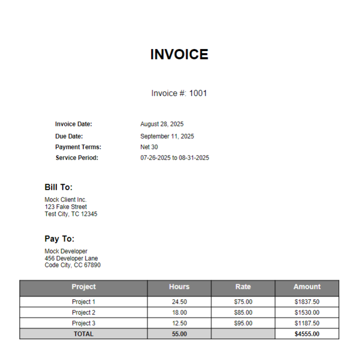

# Toggl Invoice Generator

A tool to take mappings of your Toggl projects and hourly rates and generate invoices from them. In addition, a detailed report is downloaded from Toggl as a PDF.

## Example Invoice

Here's what a generated invoice looks like:

[](example-invoice.pdf)

*Click the image above to view the full PDF invoice*

## Usage

This project is packaged with [uv](https://docs.astral.sh/uv/), so the easiest way to run it is to install uv and run the following command:
```bash
uvx --from git+https://github.com/slashtechno/toggl-invoice-generator toggl-invoice-generator
```

## Configuration

You do, however, need to either have a `config.toml` file in the current directory. If you don't, you will be prompted to enter the path to your config.toml file. The config.toml file should follow the format of [example.config.toml](example.config.toml)
